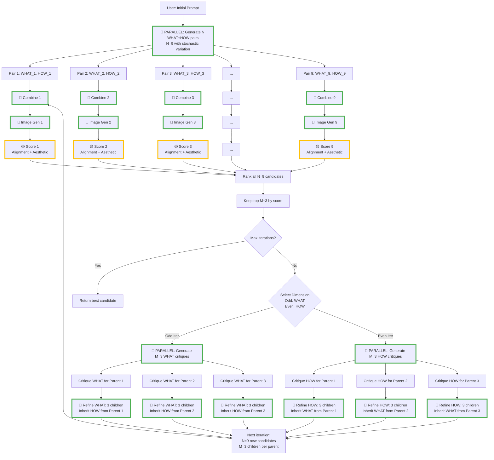

# Beam Search Flow

Parameters:
- N = Total candidates per iteration (e.g., 9)
- M = Top candidates to keep (e.g., 3, where M < N)
- Expansion ratio = N/M (e.g., 3 children per parent)

## Key Parallelization Points (🔵 Green)

1. **Initial expansion**: N WHAT+HOW pairs generated simultaneously with temperature > 0
2. **Combine prompts**: N combines happen in parallel
3. **Image generation**: All N images generated in parallel
4. **Critique generation**: M critiques (one per surviving parent) in parallel
5. **Refinement**: Each parent generates N/M children in parallel

## Sequential Within Each (🟡 Yellow)

- Alignment + Aesthetic scoring happen in parallel for each image
- But we could make these even more parallel if Vision provider supports it

## Iteration Flow

**Iteration 0:**
- Input: 1 user prompt
- Output: N=9 candidates → Keep top M=3
- Dimension: WHAT (content)

**Iteration 1+:**
- Input: M=3 parents
- Each parent → N/M=3 children
- Output: N=9 candidates → Keep top M=3
- Dimension: Alternates WHAT/HOW
