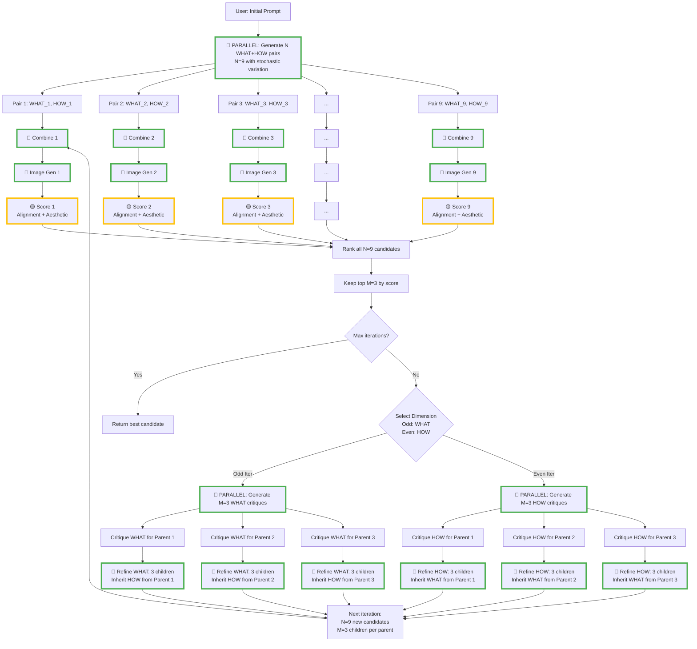

# Streaming Parallel Architecture

> **⚠️ CRITICAL REFERENCE**: This document MUST be consulted when implementing the beam search orchestrator.
> It defines the performance-critical streaming parallel execution model that maximizes async throughput.

This document describes the streaming parallel execution model for the beam search image generation pipeline.

## Overview

The pipeline is designed for **maximum throughput** using streaming parallelism, where candidates flow through processing stages independently rather than waiting for batch completion.

## Algorithm Parameters

- **N** = Total candidates per iteration (e.g., 9)
- **M** = Top candidates to keep after ranking (e.g., 3, where M < N)
- **Expansion ratio** = N/M (e.g., 3 children per parent)

## Complete Beam Search Flow



### Color Legend

- 🔵 **Green border** = Parallel operations (can run simultaneously)
- 🟡 **Yellow border** = Per-candidate operations (alignment + aesthetic run in parallel within each candidate)
- No border = Sequential dependencies

### Key Parallelization Points (🔵 Green)

1. **Initial expansion**: N WHAT+HOW pairs generated simultaneously with temperature > 0
2. **Combine prompts**: N combines happen in parallel
3. **Image generation**: All N images generated in parallel
4. **Critique generation**: M critiques (one per surviving parent) in parallel
5. **Refinement**: Each parent generates N/M children in parallel

### Per-Candidate Parallelism (🟡 Yellow)

- Within each candidate's scoring: Alignment + Aesthetic evaluation happen in parallel
- This provides 2-3s speedup per candidate

### Iteration Flow

**Iteration 0:**

- Input: 1 user prompt
- Output: N=9 candidates → Keep top M=3
- Dimension: WHAT (content)

**Iteration 1+:**

- Input: M=3 parents
- Each parent → N/M=3 children
- Output: N=9 candidates → Keep top M=3
- Dimension: Alternates WHAT/HOW

## Key Principle: Two Streaming Zones

The pipeline has **two streaming parallel zones** separated by a **ranking barrier**.

### Zone 1: Initial Expansion → Scoring (Streaming)

```
InitExpand ──┬─> (WHAT1, HOW1) ─> Combine1 ─> Img1 ─> Score1 ─┐
             ├─> (WHAT2, HOW2) ─> Combine2 ─> Img2 ─> Score2 ─┤
             ├─> (WHAT3, HOW3) ─> Combine3 ─> Img3 ─> Score3 ─┤
             ├─> ...                                          ├─> Rank
             └─> (WHAT9, HOW9) ─> Combine9 ─> Img9 ─> Score9 ─┘
```

Each candidate flows through its pipeline independently:

1. As soon as WHAT+HOW pair is generated → Combine starts
2. As soon as Combine finishes → Image generation starts
3. As soon as Image is ready → Scoring starts (alignment + aesthetic in parallel)

**No waiting for batch completion** - each lane runs at full speed.

### Barrier: Ranking

All scores must complete before ranking can determine top M candidates.

### Zone 2: Critique → Refinement → Scoring (Streaming)

```
Parent1 ─> Critique1 ─┬─> RefineWHAT_1a ─> Combine ─> Img ─> Score ─┐
                       ├─> RefineWHAT_1b ─> Combine ─> Img ─> Score ─┤
                       └─> RefineWHAT_1c ─> Combine ─> Img ─> Score ─┤
                                                                      │
Parent2 ─> Critique2 ─┬─> RefineWHAT_2a ─> Combine ─> Img ─> Score ─┤
                       ├─> RefineWHAT_2b ─> Combine ─> Img ─> Score ─┼─> Rank
                       └─> RefineWHAT_2c ─> Combine ─> Img ─> Score ─┤
                                                                      │
Parent3 ─> Critique3 ─┬─> RefineWHAT_3a ─> Combine ─> Img ─> Score ─┤
                       ├─> RefineWHAT_3b ─> Combine ─> Img ─> Score ─┤
                       └─> RefineWHAT_3c ─> Combine ─> Img ─> Score ─┘
```

After ranking:

1. Top M parents start critique generation in parallel
2. As soon as each critique finishes → Generate N/M children refinements
3. Each child flows through combine→image→score independently

**Barrier: Ranking (again)**

## Implementation Pattern

### Streaming Pipeline Function

```javascript
/**
 * Process a single candidate through the full pipeline
 * This function enables streaming - start it and it runs to completion
 */
async function processCandidateStream(whatPrompt, howPrompt, options = {}) {
  // Stage 1: Combine prompts
  const combined = await llm.combinePrompts(whatPrompt, howPrompt);

  // Stage 2: Generate image (starts as soon as combine finishes)
  const image = await imageGen.generateImage(combined, {
    iteration: options.iteration,
    candidateId: options.candidateId,
    dimension: options.dimension
  });

  // Stage 3: Score in parallel (starts as soon as image finishes)
  const [alignment, aesthetic] = await Promise.all([
    vision.evaluateAlignment(image.url, combined),
    vision.evaluateAesthetic(image.url)
  ]);

  const totalScore = calculateTotalScore(alignment, aesthetic, options.alpha);

  return {
    whatPrompt,
    howPrompt,
    combined,
    image,
    alignment,
    aesthetic,
    totalScore,
    metadata: {
      iteration: options.iteration,
      candidateId: options.candidateId,
      dimension: options.dimension,
      parentId: options.parentId
    }
  };
}
```

### Zone 1: Initial Expansion

```javascript
async function initialExpansion(userPrompt, config) {
  const { beamWidth: N } = config;

  // Generate N WHAT+HOW pairs in parallel with stochastic variation
  const whatHowPairs = await Promise.all(
    Array(N).fill().map(async (_, i) => {
      // These can run in parallel - independent LLM calls
      const [what, how] = await Promise.all([
        llm.refinePrompt(userPrompt, { dimension: 'what', operation: 'expand' }),
        llm.refinePrompt(userPrompt, { dimension: 'how', operation: 'expand' })
      ]);
      return { what: what.refinedPrompt, how: how.refinedPrompt };
    })
  );

  // Stream all N candidates through the pipeline
  // Each starts combine→image→score as soon as its WHAT+HOW is ready
  const candidates = await Promise.all(
    whatHowPairs.map(({ what, how }, i) =>
      processCandidateStream(what, how, {
        iteration: 0,
        candidateId: i,
        dimension: 'what'
      })
    )
  );

  // BARRIER: Must wait for all candidates before ranking
  return candidates;
}
```

### Barrier: Ranking and Selection

```javascript
function rankAndSelect(candidates, keepTop) {
  // Sort by total score descending
  const ranked = [...candidates].sort((a, b) => b.totalScore - a.totalScore);

  // Keep top M
  return ranked.slice(0, keepTop);
}
```

### Zone 2: Refinement Iteration

```javascript
async function refinementIteration(parents, config, iteration) {
  const { beamWidth: N, keepTop: M } = config;
  const expansionRatio = N / M;
  const dimension = iteration % 2 === 0 ? 'what' : 'how';

  // Generate M critiques in parallel (one per parent)
  const parentsWithCritiques = await Promise.all(
    parents.map(async (parent) => {
      const critique = await critiqueGen.generateCritique(
        {
          alignmentScore: parent.alignment,
          aestheticScore: parent.aesthetic,
          analysis: parent.image.metadata.analysis
        },
        {
          what: parent.whatPrompt,
          how: parent.howPrompt,
          combined: parent.combined
        },
        {
          dimension,
          iteration
        }
      );
      return { ...parent, critique };
    })
  );

  // Generate all children and stream them through the pipeline
  // Each parent generates expansionRatio children
  const allChildren = await Promise.all(
    parentsWithCritiques.flatMap((parent, parentIdx) =>
      Array(expansionRatio).fill().map(async (_, childIdx) => {
        // Refine the selected dimension
        const refined = await llm.refinePrompt(
          dimension === 'what' ? parent.whatPrompt : parent.howPrompt,
          {
            operation: 'refine',
            dimension,
            critique: parent.critique
          }
        );

        // Inherit the other dimension
        const whatPrompt = dimension === 'what' ? refined.refinedPrompt : parent.whatPrompt;
        const howPrompt = dimension === 'how' ? refined.refinedPrompt : parent.howPrompt;

        // Stream through combine→image→score
        return processCandidateStream(whatPrompt, howPrompt, {
          iteration,
          candidateId: parentIdx * expansionRatio + childIdx,
          dimension,
          parentId: parent.metadata.candidateId
        });
      })
    )
  );

  // BARRIER: Must wait for all children before ranking
  return allChildren;
}
```

### Complete Beam Search Loop

> **⚠️ IMPORTANT DESIGN DECISION**: Iteration 0 is deliberately special-cased rather than abstracted into the main loop.
>
> **Rationale**: Iteration 0 has a fundamentally different entry point:
>
> - **Iteration 0**: Starts at expansion/combine (no critique, no parent)
> - **Iteration 1+**: Starts at critique stage (has parents with scores)
>
> This is not a DRY violation - it reflects the actual algorithm structure. Both paths use the same building blocks (`processCandidateStream`, `llm.refinePrompt`, `rankAndSelect`) but have legitimately different control flow.

```javascript
async function beamSearch(userPrompt, config) {
  const { maxIterations, keepTop: M } = config;

  // Zone 1: Initial expansion (Iteration 0 - special case)
  let candidates = await initialExpansion(userPrompt, config);

  // BARRIER: Rank and select
  let topCandidates = rankAndSelect(candidates, M);

  // Iterate until convergence or max iterations
  for (let iteration = 1; iteration < maxIterations; iteration++) {
    // Zone 2: Refinement (Iteration 1+ - normal flow)
    candidates = await refinementIteration(topCandidates, config, iteration);

    // BARRIER: Rank and select
    topCandidates = rankAndSelect(candidates, M);

    // Check convergence (optional)
    if (hasConverged(topCandidates)) {
      break;
    }
  }

  // Return best candidate
  return topCandidates[0];
}
```

## Performance Characteristics

### Streaming vs Batched

**Batched approach (slower):**

```javascript
// Wait for all combines
const combines = await Promise.all(pairs.map(p => combine(p)));
// Then wait for all images
const images = await Promise.all(combines.map(c => generateImage(c)));
// Then wait for all scores
const scores = await Promise.all(images.map(i => score(i)));
```

**Streaming approach (faster):**

```javascript
// Each candidate flows through independently
const results = await Promise.all(
  pairs.map(async (p) => {
    const combined = await combine(p);      // Start ASAP
    const image = await generateImage(combined);  // Start as soon as combine done
    const score = await scoreImage(image);  // Start as soon as image done
    return { combined, image, score };
  })
);
```

### Throughput Analysis

With N=9 candidates and assuming:

- Combine: 2s
- Image gen: 10s
- Score: 3s
- Total per candidate: 15s

**Batched:** 2s + 10s + 3s = **15s per iteration**

**Streaming:** All 9 running in parallel = **15s per iteration** (same wall clock time, but candidates complete progressively)

The advantage of streaming is:

1. First candidate can be analyzed while others are still processing
2. Failures can be detected earlier
3. Resource utilization is smoother (not bursty)
4. Better for monitoring/debugging (progressive results)

## Within-Candidate Parallelism

Inside each candidate's scoring phase, alignment and aesthetic evaluation can run in parallel:

```javascript
// Within processCandidateStream
const [alignment, aesthetic] = await Promise.all([
  vision.evaluateAlignment(image.url, combined),
  vision.evaluateAesthetic(image.url)
]);
```

This provides another **2-3s speedup per candidate** if both evaluations take similar time.

## Barrier Points

There are exactly **two types of barriers** where streaming must stop:

1. **Ranking barrier**: Must wait for ALL candidates to complete scoring before ranking
2. **Iteration barrier**: Must complete one full iteration before starting the next

These barriers are **unavoidable** due to algorithm requirements:

- Can't rank until all scores are known
- Can't refine until parents are selected

## Implementation Checklist

The orchestrator has been implemented with all these features:

- [x] Use `Promise.all()` for parallel operations within a zone ✅
- [x] Use async pipelines (not batched stages) for streaming ✅
- [x] Ensure alignment + aesthetic scoring happens in parallel ✅
- [x] Critique generation happens in parallel for all M parents ✅
- [x] Each parent's N/M children start processing as soon as critique is ready ✅
- [x] Only wait at barrier points (ranking) ✅
- [x] Log progressive completion for monitoring ✅

**Implementation**: [src/orchestrator/beam-search.js](../src/orchestrator/beam-search.js)

## Benefits

1. **Maximum throughput**: No artificial waiting between stages
2. **Progressive results**: See candidates complete as they finish
3. **Better resource utilization**: Smooth continuous load
4. **Early failure detection**: Bad candidates fail fast
5. **Easier debugging**: Can inspect partial results
6. **Scalable**: Works efficiently with any N and M values
