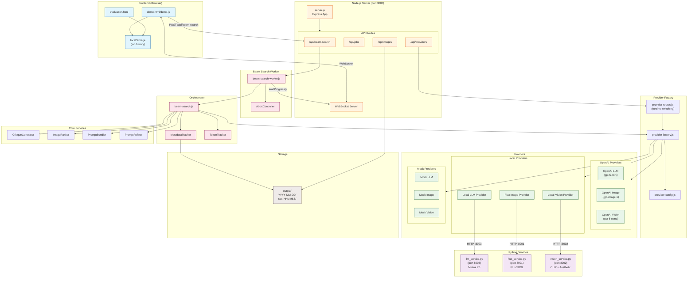
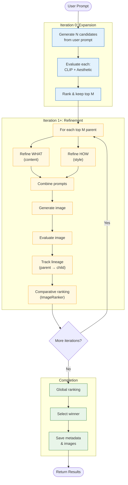
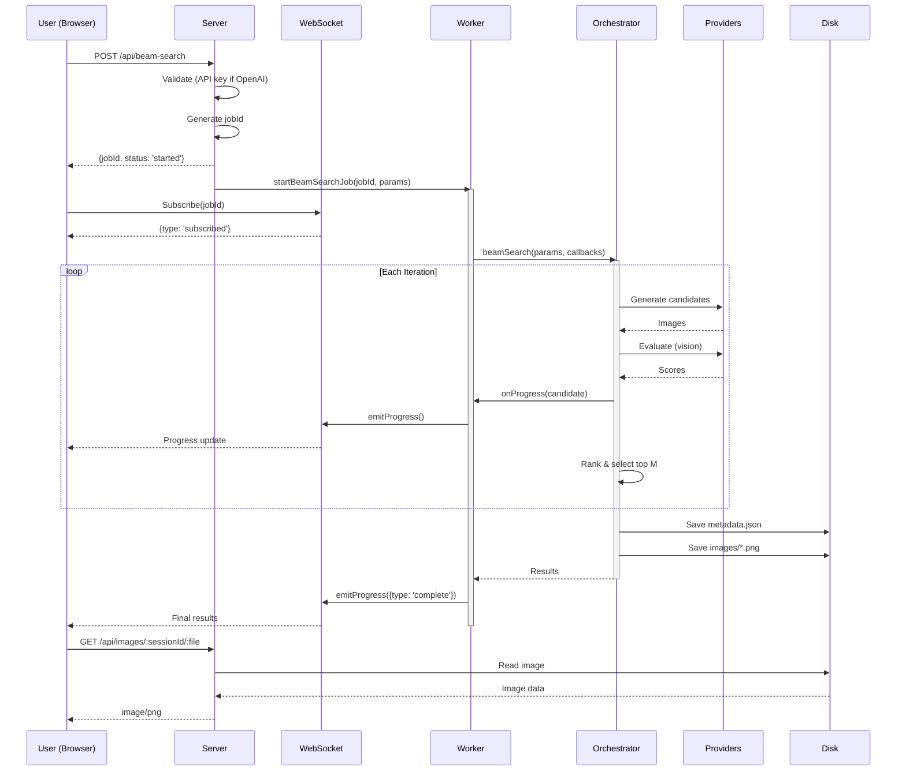
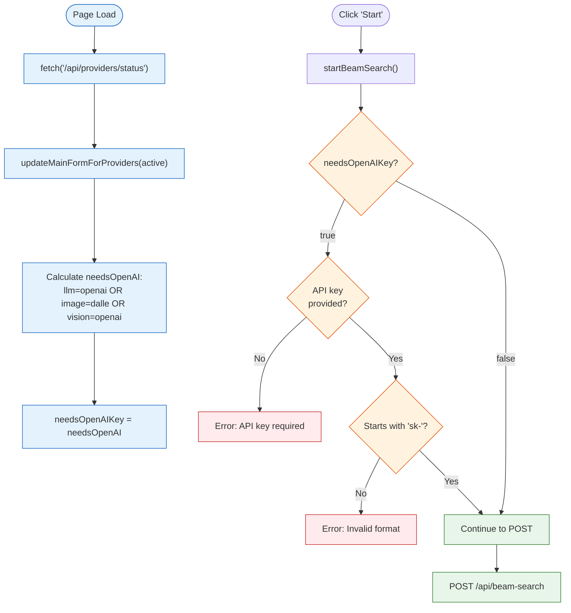
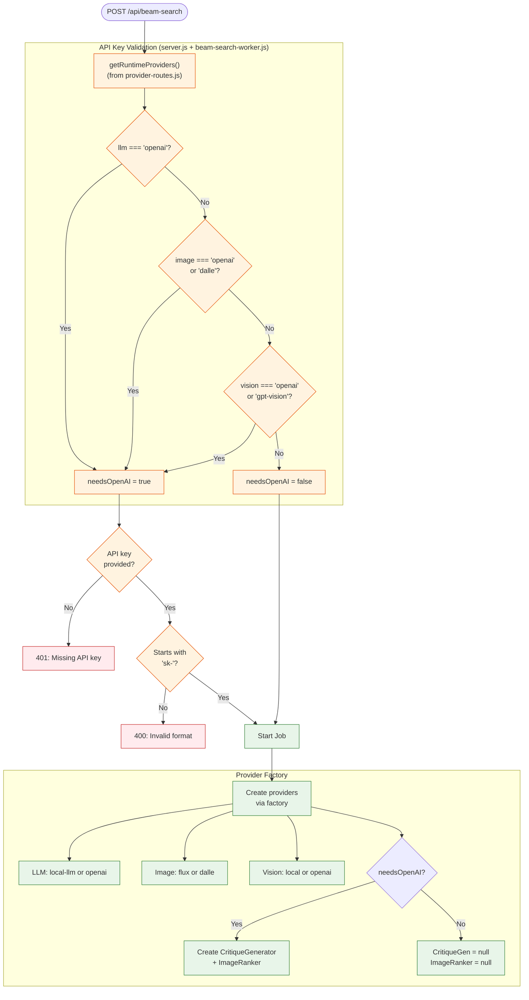
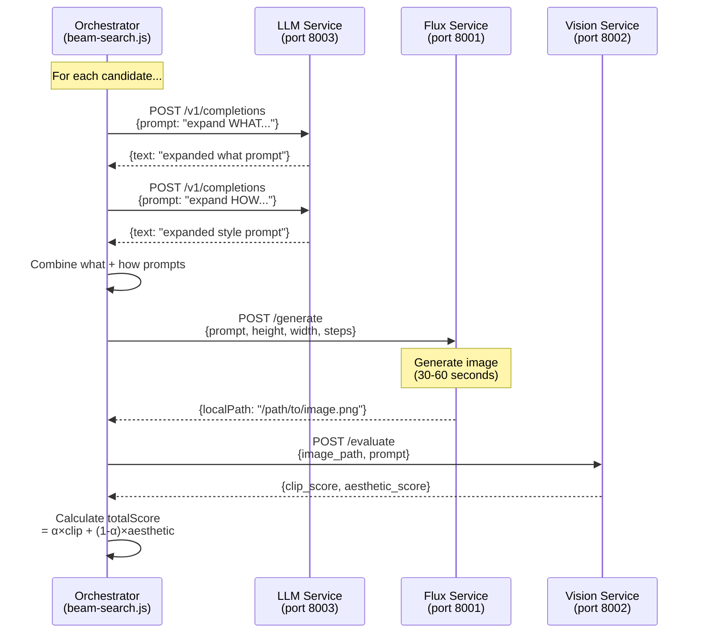
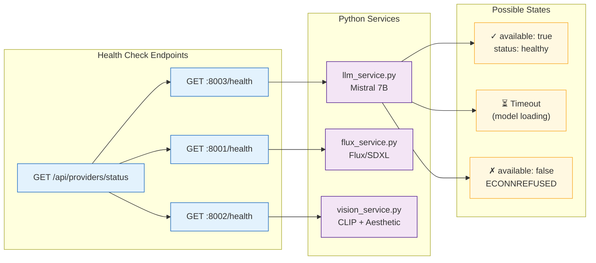

# Image Generation Pipeline - Architecture

## System Overview



## Beam Search Algorithm Flow



## Provider Selection Flow

```mermaid
flowchart LR
    subgraph Config["Configuration"]
        env["Environment Variables"]
        file["provider-config.js"]
        ui["UI Provider Settings"]
    end

    subgraph Runtime["Runtime State"]
        rp["runtimeProviders<br/>(in-memory)"]
    end

    subgraph Factory["Provider Factory"]
        create["createLLMProvider()<br/>createImageProvider()<br/>createVisionProvider()"]
    end

    subgraph Decision{"Provider Type?"}
        mode{mode?}
    end

    subgraph Providers["Provider Instances"]
        openai["OpenAI Provider"]
        local["Local Provider"]
        mock["Mock Provider"]
    end

    env --> file
    file --> rp
    ui -->|"POST /api/providers/switch"| rp

    rp --> create
    create --> mode

    mode -->|"mock"| mock
    mode -->|"real + openai"| openai
    mode -->|"real + local"| local

    local -->|"HTTP"| python["Python Service"]

    classDef config fill:#fff3e0,stroke:#e65100
    classDef runtime fill:#e8eaf6,stroke:#3f51b5
    classDef provider fill:#e8f5e9,stroke:#2e7d32

    class env,file,ui config
    class rp,create runtime
    class openai,local,mock,python provider
```

## Data Flow: Job Lifecycle



## API Key Validation Flow

This diagram shows how **both frontend and backend** conditionally require an API key based on active providers.

### Frontend Validation (demo.js)



### Backend Validation (server.js)



## Service Communication Flow

Shows how the Node.js orchestrator communicates with local Python services.



**Timeouts:**
- LLM: 180 seconds per completion (3 min - accounts for queue wait)
- Flux: 120 seconds per image
- Vision: 30 seconds per evaluation

**⚠️ Sequential Processing:** Local Python services process requests sequentially on a single GPU. With 4 parallel beam search candidates, later requests wait in queue. Example timing:
- Request 1: ~30s (immediate processing)
- Request 2: ~50s (waited ~20s in queue)
- Request 3: ~70s (waited ~40s in queue)
- Request 4: ~90s (waited ~60s in queue)

## Debug: Service Health Checks



## Debugging Notes

### Issue: API Key Required When Using Local Providers (FIXED)

**Root Cause:** ES Module vs CommonJS import mismatch

```
# Before (broken):
server.js (ES module) → require('./provider-routes.js') → getRuntimeProviders undefined

# After (fixed):
server.js (ES module) → import { getRuntimeProviders } from './provider-routes.js' → works
```

**Files Fixed (Backend):**
- `src/api/server.js:15` - Changed to ES module import
- `src/api/demo-routes.js:9` - Changed to ES module import

**Files Fixed (Frontend):**
- `public/demo.js:28` - Added global `needsOpenAIKey` variable
- `public/demo.js:2117` - `updateMainFormForProviders()` sets `needsOpenAIKey` global
- `public/demo.js:1297` - `startBeamSearch()` conditionally validates API key based on `needsOpenAIKey`

### Issue: LLM Service "Broken pipe" / OOM (FIXED)

**Symptom:** Job fails with `HTTP 500: {"detail":"[Errno 32] Broken pipe"}`

**Root Cause:** Mistral 7B needs ~14GB in float16, but GPU only has 12GB total

**Fix:** Enabled 8-bit quantization (reduces ~14GB → ~7GB)
- `services/llm_service.py` - Added `USE_8BIT` config and `BitsAndBytesConfig`
- `services/requirements.txt` - Uncommented `bitsandbytes>=0.41.0`

**Environment Variables:**
- `LLM_USE_8BIT=true` (default) - Use 8-bit quantization
- `LLM_USE_8BIT=false` - Use full precision (requires 14GB+ VRAM)

### Issue: LLM Request Timeout with Parallel Beam Search (FIXED)

**Symptom:** Some LLM requests fail with "Cannot reach local LLM service" while others succeed. Failures occur at exactly 60 seconds.

**Root Cause:** Beam search sends 4 parallel LLM requests, but local LLM processes them sequentially on single GPU. Each request takes ~20-30s, so request 4 waits ~60-90s total, exceeding the 60s timeout.

**Fix:** Increased timeout in `src/providers/local-llm-provider.js` from 60s to 180s (3 minutes).

### Improvement: Serial Processing + llama.cpp (IMPLEMENTED)

**Problem:** Multiple parallel LLM requests overwhelm single-GPU services, and HuggingFace transformers uses excessive memory.

**Solution (3 parts):**

1. **Serial Rate Limiting** - Local providers use concurrency=1
   - `src/config/rate-limits.js` - Added `local` limits section
   - `src/orchestrator/beam-search.js` - Added `configureRateLimitsForProviders()`
   - `src/api/beam-search-worker.js` - Configures limits based on provider type

2. **llama.cpp instead of Transformers** - Much more memory efficient
   - `services/llm_service.py` - Rewrote to use `llama-cpp-python`
   - Uses GGUF quantized models (Q4_K_M: ~4GB vs float16: ~14GB)
   - Supports HuggingFace Hub download or local path

3. **Model Load/Unload Endpoints** - For GPU coordination
   - All services now have `/load` and `/unload` endpoints
   - `src/utils/model-coordinator.js` - Helper for orchestrating model swaps

**Environment Variables (LLM Service):**
```bash
LLM_MODEL_REPO="TheBloke/Mistral-7B-Instruct-v0.2-GGUF"  # HuggingFace repo
LLM_MODEL_FILE="*Q4_K_M.gguf"  # Glob pattern for model file
LLM_MODEL_PATH="/path/to/local.gguf"  # Override for local file
LLM_GPU_LAYERS=32  # Number of layers on GPU (-1 = all)
LLM_CONTEXT_SIZE=2048
```

### Issue: LLM Service Health Check Timeout

**Symptom:** Health check times out, job fails with "Cannot reach local LLM service"

**Possible Causes:**
1. Model still loading (Mistral 7B = ~7GB with 8-bit, can take 1-2 min)
2. Service crashed during model load (check memory)
3. GPU memory exhaustion

**Debug Commands:**
```bash
# Check service ports
lsof -i :8001 -i :8002 -i :8003 | grep LISTEN

# Check service health with timeout
timeout 3 curl http://localhost:8003/health

# Check provider status
curl http://localhost:3000/api/providers/status | jq .health
```

---

## File Structure

```
image-gen-pipe-v2/
├── public/                     # Frontend
│   ├── demo.html              # Main UI
│   ├── demo.js                # UI logic, WebSocket client
│   └── evaluation.html        # A/B comparison UI
│
├── src/
│   ├── api/                   # HTTP/WebSocket layer
│   │   ├── server.js          # Express + WebSocket server
│   │   ├── beam-search-worker.js  # Job execution
│   │   ├── demo-routes.js     # Demo endpoints
│   │   ├── provider-routes.js # Provider management
│   │   └── evaluation-routes.js
│   │
│   ├── orchestrator/          # Core algorithm
│   │   └── beam-search.js     # Beam search implementation
│   │
│   ├── providers/             # Provider implementations
│   │   ├── openai-llm-provider.js
│   │   ├── openai-image-provider.js
│   │   ├── openai-vision-provider.js
│   │   ├── local-llm-provider.js
│   │   ├── flux-image-provider.js
│   │   ├── local-vision-provider.js
│   │   └── mock-*.js          # Mock providers
│   │
│   ├── factory/               # Provider factory
│   │   └── provider-factory.js
│   │
│   ├── services/              # Business logic
│   │   ├── critique-generator.js
│   │   ├── image-ranker.js
│   │   ├── prompt-bundler.js
│   │   ├── prompt-refiner.js
│   │   └── metadata-tracker.js
│   │
│   ├── config/                # Configuration
│   │   ├── provider-config.js
│   │   └── rate-limits.js
│   │
│   └── utils/                 # Utilities
│       ├── token-tracker.js
│       ├── rate-limiter.js
│       └── model-coordinator.js  # GPU model coordination
│
├── services/                  # Python local services
│   ├── llm_service.py         # llama.cpp LLM (port 8003)
│   ├── flux_service.py        # Flux/SDXL (port 8001)
│   ├── vision_service.py      # CLIP + Aesthetic (port 8002)
│   └── requirements.txt
│
└── output/                    # Generated content
    └── YYYY-MM-DD/
        └── ses-HHMMSS/
            ├── metadata.json
            └── *.png
```
